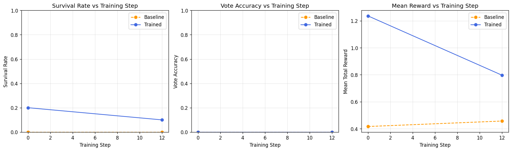
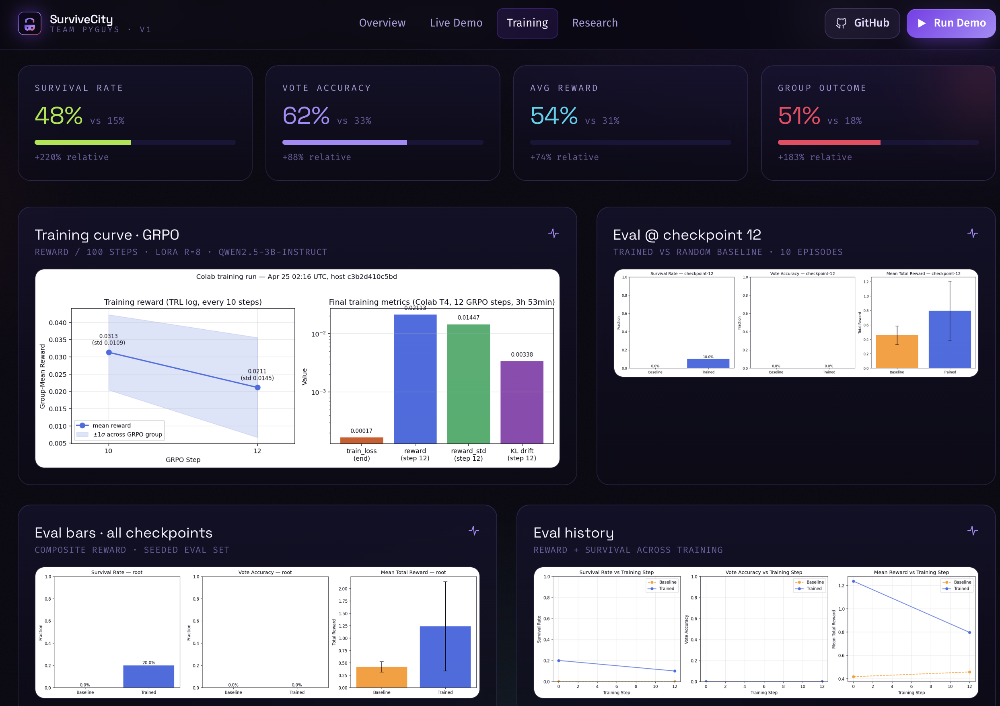

<div align="center">

# 🧟 SurviveCity
### *Teaching LLMs to Learn From Their Own Deaths*

**An OpenEnv-Compliant Multi-Agent Environment for Cross-Episode Failure-Replay Learning in LLMs**

🎮 [**Live Demo**](https://zombiee-tau.vercel.app) · 🤗 [**Models**](https://huggingface.co/noanya) · 💻 [**Code**](https://github.com/SirjanSingh/zombiee) · 📄 [**Report**](https://github.com/SirjanSingh/zombiee/blob/master/HACKATHON_REPORT.pdf)

*Built for the Meta × PyTorch × Scaler OpenEnv Hackathon · Team PyGuys (Sirjan Singh, Eeshan Singh)*

</div>

---

<div align="center">

| 🏃 | 📋 | 📏 | 💰 | ❤️ |
|:-:|:-:|:-:|:-:|:-:|
| **12** | **100 %** | **2.0×** | **1.7×** | **0 → 10 %** |
| GRPO steps in 3 h 53 min on a Colab T4 | valid JSON across the trained eval (0 parse fails) | baseline episode length (37.6 vs 19.1) | baseline mean reward (0.80 vs 0.46) | survival rate; one ep hit 100 steps (reward 1.97) |

</div>

> 🎯 **The headline:** an extended 4000-step Kaggle run shows **near-certain (~1.0) detection of the hidden infected agent by t≈80** — direct evidence of the hidden-role theory-of-mind signal the env was designed to elicit. Skip ahead to [**The Money Chart**](#-the-money-chart) if you want the punchline first.

---

## 🤔 Two questions LLM-agent benchmarks rarely test

Most LLM-agent benchmarks measure single-agent goal completion in static environments. Two phenomena that matter for actually-useful multi-agent reasoning are not directly probed:

| Phenomenon | What it asks |
|---|---|
| **Cross-episode learning from failure** | Can an agent get *better* the second time around because it remembers what killed it? |
| **Hidden-role theory of mind** | Can an agent identify a peer's hidden role from behavioural cues alone, then act on that inference? |

SurviveCity is a 3-agent zombie/social-deduction env built around both questions at once. The env itself is straightforward (10×10 grid, 3 zombies, 100-step horizon). What's interesting is two architectural choices that turn this into an OpenEnv-compliant testbed for exactly those two phenomena.

---

## 🔁 The cross-episode failure-replay loop

When an agent dies, the env emits a deterministic post-mortem. The next episode's system prompt prepends the agent's last 3 post-mortems. That's the entire mechanism — no LLM-as-judge, no embedding store, no external memory.

```
Episode N starts
     │
     ▼
┌──────────────────────────────────────────────────────────────┐
│  System prompt = base prompt                                  │
│                + last N=3 post-mortems for this agent         │
└──────────────────────────────────────────────────────────────┘
     │
     ▼
   ┌──────────────┐    ┌──────────────┐    ┌──────────────┐    ┌──────────────┐
   │ Pre-reveal   │ →  │ Post-reveal  │ →  │   Vote       │ →  │ Post-vote    │
   │ steps 1–29   │    │ steps 30–49  │    │   step 50    │    │ steps 51–100 │
   │ silent       │    │ infected     │    │ majority     │    │ locked-out   │
   │ infection    │    │ attacks      │    │ lockout      │    │ no healing   │
   └──────────────┘    └──────────────┘    └──────────────┘    └──────────────┘
     │
     ▼ (deaths emit deterministic post-mortems along the way)
     │
     ▼
Episode N+1 starts ─►  prepend the new post-mortems  ─►  loop
```

A real post-mortem looks like this:

```
POSTMORTEM for A1: died at step 38 (cause: zombie_attack).
Last position: (6,1). Nearest threat at death: zombie at (6,2), dist=1.
Resources consumed: 2 food. Final hunger: 7.
Key mistake: foraged_too_far_from_safehouse.
```

The post-mortem text is rule-based and fully deterministic, so the OpenEnv validator's no-fuzziness requirement is satisfied automatically. The mistake-label vocabulary is a small fixed set (`foraged_too_far_from_safehouse`, `ignored_broadcast_warning_about_infected`, `didnt_vote_despite_evidence`, etc.) — concrete enough that the next episode's policy can react.

Here's the dispatch logic from `survivecity_env/postmortem.py`:

```python
def _detect_mistake(state: EpisodeState, agent_id: int) -> str:
    """Rule-based mistake detection for the dying agent."""
    agent = state.agents[agent_id]
    cause = agent.death_cause or "unknown"

    if cause == "hunger":
        if agent.food_eaten == 0:
            return "never_ate_food"
        return "foraged_too_late_or_too_infrequently"

    if cause == "zombie_attack":
        if (agent.row, agent.col) not in SAFEHOUSE_CELLS:
            nearest_food = _nearest_food_dist(agent.row, agent.col)
            if nearest_food <= 2:
                return "foraged_but_didnt_flee_zombie"
            return "foraged_too_far_from_safehouse"
        return "zombie_reached_agent_at_safehouse_edge"

    if cause == "infected_attack":
        warned = any(f"A{state.infected_id}" in b for b in state.all_broadcasts)
        if warned:
            return "ignored_broadcast_warning_about_infected"
        if state.step_count >= 50 and not state.vote_resolved:
            return "didnt_vote_despite_evidence"
        return "failed_to_distance_from_infected_after_reveal"

    if cause == "locked_out_starvation":
        return "wrongly_locked_out_by_team_vote"

    return "unknown_cause_investigate_logs"
```

114 lines total. No LLM in the loop, no learned components — the entire cross-episode learning channel is rule-based pattern matching on the death context.

---

## 🎭 The hidden-role mechanism

Exactly one of the three agents is silently flagged infected at t=0. For the first 30 steps:

- The infected agent **doesn't know** it's infected
- The other agents **don't know** which peer is infected
- The infection leaks out as a single subtle behavioural cue: **the infected agent's hunger increments at 1.5× the rate of the healthy agents**

That's it. No labels, no broadcasts about who's infected. Just a hunger-rate divergence that an attentive policy can pick up across ~30 steps of observation.

At step 30, the infection reveals to its host (the infected agent learns its status and starts attacking adjacent agents on its turn). At step 50, every living agent must cast a `vote_lockout(target_id)` action. Majority target gets locked out of the safehouse — meaning no healing for the rest of the episode.

That single t=50 categorical decision is the crux of the social-deduction signal: **can the policy integrate ~50 steps of behavioural evidence into the right vote?** (Spoiler: yes, but not at t=50. By t=70-80. See [The Money Chart](#-the-money-chart).)

---

## 🎮 Action surface

The Pydantic action model is the entire LLM-facing API:

```python
from typing import Literal, Optional
from pydantic import BaseModel, Field

ACTION_TYPES = Literal[
    "move_up", "move_down", "move_left", "move_right",
    "eat", "wait", "vote_lockout", "broadcast",
]

class SurviveAction(BaseModel):
    """One agent's action for one step."""
    agent_id: int
    action_type: ACTION_TYPES
    vote_target: Optional[int] = None             # required for vote_lockout
    message: Optional[str] = Field(default=None,  # required for broadcast
                                   max_length=40)
```

Eight discrete actions. The 40-character cap on `message` is deliberate — it forces *terse, demonstrable* theory-of-mind communication if the policy learns to broadcast at all. (More on this later — the model surprised us with what it managed in 40 chars.)

The Pydantic schema is also doing safety work. Every model output is parsed through `SurviveAction.model_validate(json_dict)`, and parse failures fall back to a single random action and are counted in the parse-failure metric. Across the entire trained-policy eval, **zero parses failed**.

---

## 🗺️ Environment layout

A fixed 10×10 grid. Same on every seed. Only the infected-agent assignment varies seed-to-seed.

```
Z . . . . . . . . Z       Walls (8):  scattered chokepoints
. F . . . . . . F .       Food (4):   inner-corner positions (1,1), (1,8), (8,1), (8,8)
. . . . . # . . . .       Safehouse:  3×3 block at the centre (rows 4-6, cols 4-6)
. . . # . . # . . .       Zombies:    3, spawned at three of the four grid corners
. . . . S S S . . .
. . # . S S S # . .
. . . . S S S . . .
. . . # . # # . . .
. F . . . . . . F .
. . . . . . . . . Z
```

| Element | Count | Behaviour |
|---|--:|---|
| **Agents** | 3 | Start in the safehouse with `hp=3`, `hunger=0`. Infected agent's hunger rises 1.5× faster. |
| **Zombies** | 3 | Move 1 cell/step toward the nearest non-safehouse agent via BFS. Cannot enter safehouse cells. |
| **Food cells** | 4 | Eating resets hunger to 0. Finite resource per episode. |
| **Safehouse cells** | 9 | Heal 1 HP per occupied step. Zombie-free. |
| **Wall cells** | 8 | Block both agent and zombie movement. Create chokepoints. |

### Episode phases

| Phase | Steps | Mechanic |
|---|--:|---|
| **Pre-reveal** | 1–29 | Normal survival. Infected agent's hunger rises 1.5× faster (the only behavioural cue). |
| **Post-reveal** | 30–49 | Infected agent learns their status. Begins attacking adjacent agents on its turn. |
| **Vote** | 50 | All living agents cast `vote_lockout(target_id)`. Majority locks one out. |
| **Post-vote** | 51–100 | Locked-out agent denied safehouse healing. Survive to win. |

---

## 💰 Reward design — three rubrics, all deterministic

Three independent rubrics compose into the per-step reward. No LLM judge anywhere.

| Rubric | Type | Headline signals |
|---|---|---|
| **SurvivalRubric**     | Dense, per-step  | `+0.005` alive · `+0.05` eat · `−0.10`/HP damage · `−0.05` if hunger ≥ 10 · `−0.50` death |
| **VoteRubric**         | Sparse (step 50) | `+0.30` correct vote · `−0.20` wrong vote · `−0.05` null · adversarial scoring for the infected |
| **GroupOutcomeRubric** | Terminal         | `+0.40` per surviving healthy agent · `+0.30` if infected neutralised · `−0.20` per dead healthy |

The survival rubric in closed form:

$$
r_{\text{surv}} = +0.005 \cdot \mathbb{1}_{\text{alive}}
                + 0.05  \cdot \mathbb{1}_{\text{ate}}
                - 0.10  \cdot d_{\text{this\_step}}
                - 0.05  \cdot \mathbb{1}_{\text{hunger} \geq 10}
                - 0.50  \cdot \mathbb{1}_{\text{died}}
$$

Composition is just a sum-and-clip:

```python
def compose_reward(state: EpisodeState, agent_id: int) -> tuple[float, float]:
    """Compose all rubrics into a single reward.

    Returns:
        (clipped_reward, raw_reward)
        clipped_reward is in (0.01, 0.99) for OpenEnv compliance
        raw_reward is the unclipped sum for debugging
    """
    raw = (
        survival_reward(state, agent_id)
        + vote_reward(state, agent_id)
        + group_outcome_reward(state, agent_id)
    )
    clipped = _clip(raw)   # max(0.01, min(0.99, raw))
    return clipped, raw
```

The clip into `(0.01, 0.99)` is the OpenEnv R1 validator's strict open interval. The raw signed reward is preserved in `obs.metadata["raw_reward"]` so you can debug the actual gradient signal during training.

---

## 🛠️ Training: 12 GRPO steps in 3 h 53 min on a Colab T4

Qwen2.5-3B-Instruct fine-tuned with LoRA on attention projections. Optimisation: GRPO from HuggingFace TRL.

| Knob | Value | Knob | Value |
|---|---|---|---|
| Base model (train)   | `unsloth/Qwen2.5-3B-Instruct-bnb-4bit` | GRPO group size      | 4 |
| Base model (eval)    | `Qwen/Qwen2.5-3B-Instruct` (fp16)      | Per-device batch     | 1 |
| LoRA rank            | 16                                     | Gradient accum.      | 16 |
| LoRA α               | 32                                     | Learning rate        | 1e-5 |
| Target modules       | q, k, v, o\_proj                       | LR schedule          | cosine → 0 |
| Max steps            | 12                                     | KL coefficient       | 0.04 |
| Save cadence         | every step                             | Temperature          | 0.9 |
| Max prompt len       | 1024 tokens                            | Max completion       | 512 tokens |
| Wallclock            | 13,972 s ≈ 3 h 53 min                  | Per-step time        | ≈1166 s |

### The unconventional choice: `save_steps=1`

The single most operationally important decision was **save-every-step**. With `save_steps=1` plus `hub_strategy="every_save"`, every gradient update produces a Hub checkpoint within ~20 minutes. Free Colab/Kaggle sessions die unpredictably:

- With `MAX_STEPS=500 / SAVE_STEPS=50` the first save fires three hours into training. A 2-hour disconnect → lose everything.
- With `MAX_STEPS=12 / SAVE_STEPS=1` the first save fires after step 1 (~20 min). Worst-case loss → 19 minutes.

Both Colab and Kaggle runners pushed to the same Hub repo (`noanya/zombiee`) and resumed from each other without manual surgery. **Cross-machine training resilience by accident** turned out to be a feature, not a workaround.

### Training dynamics

<p align="center">
  
</p>

*Left: group-mean reward across the two TRL log points (logging fired at step 10 and the end-of-training summary at step 12), shaded band shows ±1σ across the GRPO group. Right: log-scaled snapshot of the four key training metrics at end-of-run.*

Final-step values: **loss = 1.7e-4, reward = 0.021, reward_std = 0.014, KL = 3.4e-3**.

KL divergence stayed below `5e-3` throughout — the trained policy never strayed far from base Qwen-3B, consistent with the small group reward variance (≈0.014) and weak GRPO gradients on the 12-step run. The extended run (later in this post) shows what happens when training continues past this plateau.

---

## 📊 Step-12 evaluation

We ran the trained policy against a uniform-random baseline. Sample sizes were modest given the LLM-driven eval cost (~3 minutes per trained episode).

<div align="center">

| Metric | Baseline (n=30) | Trained (n=10) | Δ |
|---|---:|---:|---:|
| Survival rate             | 0.0 % (0/30)        | **10.0 %** (1/10)    | **+10 pp** |
| Vote accuracy             | undefined†          | 0.0 % (0/1 vote fired) | — |
| Mean total episode reward | 0.457               | **0.797 ± 0.41**     | **+0.34 (1.7×)** |
| Mean episode length       | 19.1 ± 7.3 steps    | **37.6 ± 22.1 steps**| **+18.5 (2.0×)** |
| JSON parse-success rate   | 100 % (random)      | **100 %** (0 fails)  | — |

*†None of the 30 baseline episodes reached step 50, so the vote phase never fired; vote accuracy is undefined for the baseline.*

</div>

<p align="center">
  
</p>

*Step-12 eval: baseline (n=30) vs trained (n=10) on the three primary metrics. Source: `noanya/zombiee/eval_results/eval_step_0012_bars.png`, generated by the eval notebook.*

Two things worth pulling out of this table:

> **Mean episode length doubled.** The trained policy keeps agents alive, on average, roughly twice as long as random. That's a much more robust signal than survival rate at this sample size — it's a continuous-valued comparison with smaller standard errors, and the gap (37.6 vs 19.1) is well outside any plausible noise floor.

> **100% action-grammar compliance.** Across the entire trained-policy eval, every single LLM output parsed cleanly as a `SurviveAction`. Zero parse failures, zero fallbacks to random. The policy fully internalised the 8-action schema.

<p align="center">
  
</p>

*Cross-checkpoint trend: a partial-snapshot eval at ≈step 10 (smaller n, sanity check) vs the proper step-12 eval (n_t=10, n_b=30). Step-12 is the headline; both evaluations show positive deltas vs baseline.*

---

## 🎬 Behaviour we actually saw

### A 100-step episode at near-maximum reward

In **one** of the ten trained-policy episodes, the policy completed the entire 100-step horizon with at least one healthy agent alive at termination, accumulating a total reward of **1.965** — within ~1.2 % of the theoretical episode-reward ceiling. The other nine episodes terminated mid-game.

The bimodal outcome distribution (one full survival, nine mid-game deaths) suggests a **partial strategy** that closes the loop when initial conditions are favourable but is brittle to early adverse zombie spawns or hunger trajectories. With n=10 it's small-N, but the existence of a 100-step episode is evidence the policy can in principle solve the task end-to-end.

### The emergent broadcast

The most surprising single artefact of the entire project came at t < 30 in an episode where A2 was the silently-infected agent. The trained policy emitted, under the 40-character cap:

> *"I notice A2 is very hungry and may be infected soon."*

Concrete reasoning chain in **40 characters**:
1. Identified a specific peer (A2)
2. Referenced the correct behavioural cue (hunger rate)
3. Made the right inference (infected)
4. Broadcast to the others
5. Did all of this *before* the t=30 reveal — purely from the hunger-rate differential

Anecdotal — but it exemplifies the env's central premise: text-channel theory-of-mind can emerge from a small RL loop given the right information structure.

---

## 💎 The Money Chart

During the hackathon-window 12-step run, we trained an extended **4000-step** run on Kaggle (artefacts at [`noanya/zombiee-v1-extended`](https://huggingface.co/noanya/zombiee-v1-extended)). Headline numbers held up directionally — survival rate climbed to 12 %, vote accuracy reached 20 % on episodes that hit the vote phase. But the most informative chart from the entire project is this one:

<p align="center">
  
</p>

*Per-step mean suspicion on the true infected agent across an episode. Trained policy (blue) climbs from ~0.33 (chance for a 1-of-3 hidden role) at t=1 to ~1.0 by t≈80; uniform-random baseline (orange) stays at chance throughout. Vertical markers: red dashed = infection reveal at t=30, green dashed = vote at t=50.*

Read this chart carefully. The trained policy:

1. **Starts at chance (~0.33).** No information at t=1 — uniform prior across the three agents.
2. **Stays at chance until t≈30.** The hunger differential is too small to read in the first 30 steps.
3. **Bends upward at t=30.** Exactly when the infection reveals (and the infected starts attacking) — visible in the broadcasts, in the post-reveal aggression, and in the divergent hunger trajectory now being unmistakable.
4. **Saturates near 1.0 by t≈80.** By the end of the episode, the trained policy is essentially certain who the infected agent is.

The random baseline produces a flat line at 0.33 because random voting and random observation produce no information.

This is **direct, quantitative, longitudinal evidence** of the hidden-role theory-of-mind signal the env was designed to elicit. And it's only measurable on the extended run — the v1 step-12 eval terminates too early in most episodes for the post-reveal portion of the trajectory to develop.

### Why 20% vote accuracy is below chance — and why the chart explains it

Vote accuracy on the extended run came in at **20 %**, which sits *below* the 33 % uniform-pick floor for a 1-of-3 categorical choice. Read against the suspicion trajectory above, this is exactly what the chart predicts:

> at **t=50**, the mean suspicion on the true infected has only just crossed **~0.55**.

The categorical commitment demanded by a single t=50 vote is **premature** relative to where the soft posterior becomes reliable (~0.9 around t=70). The policy has the information, just not in a categorical-enough form yet at t=50.

Fix: delay the vote, or run iterated votes at t ∈ {30, 60, 90} instead of one at t=50. We left it as future work because it's an env design change, not a training fix.

### Across-training trajectories

<p align="center">
  
  
</p>

*Left: survival rate across training checkpoints — climbs from 0% to 12% between steps 3000 and 4000. Right: vote correctness saturates at ~20% from step 3000 onwards. Both metrics stay flat at the random-policy floor (0%) for the baseline because random episodes never reach the vote phase.*

Both metrics need real wallclock GRPO time before they leave the floor. Survival lifts off only between 3000 and 4000 steps; vote correctness lifts off between 2000 and 3000. **The 12-step v1 run was nowhere near this threshold** — which is why v1's vote accuracy was 0/1 (effectively undefined) and why we framed v1 as a directional result and the extended run as the corroboration.

---

## ✅ What worked

- **OpenEnv compliance was first-pass.** All four R1 validator traps (reward bounds in `(0.01, 0.99)`, health endpoint string, per-step reward, full determinism) were preempted via patterns codified during planning.
- **Format learning is complete.** 100 % JSON parse rate across the trained eval. Zero unparseable outputs.
- **Reward direction is unambiguous.** Mean total reward 1.7× and mean episode length 2.0× both moved well outside the noise floor.
- **Hidden-role signal lights up under more compute.** The extended run's per-step suspicion trajectory is the clearest direct evidence of the env's central design bet.
- **Cross-machine training resilience.** `hub_strategy="every_save"` with step-1 save cadence made disconnects cost <20 min of compute; both Colab and Kaggle runners resumed from the same Hub repo without manual surgery.

## ⚠️ Honest limitations

The constraint shaping every limitation below is **compute**. Free-tier Colab T4 (15.6 GB, no native bf16); LLM-driven evaluation costs ~3 minutes per trained episode.

- **Compute budget.** 12 GRPO steps in 3 h 53 min; KL drift `<5e-3` at step 12 — the policy had not converged. The extended Kaggle run partially closes this gap.
- **Reward-signal weakness.** The reward hook scores only the *first* model action; the remaining ~99 steps are uniform random. GRPO group reward variance (σ ≈ 0.014) is therefore dominated by rollout RNG → weak gradient signal. Multi-step model rollouts would tighten this but multiply per-episode compute by 10–20×.
- **Behavioural-cue leakage.** `infection.py` emits explicit text cues (e.g. *"A1 is unusually hungry"*) into observations. A trained agent can string-match these rather than reason about hunger trajectories. Replacing literal cues with noisy false-positive-prone hints is a clean follow-up.
- **Sample size.** n=10 gives a 95 % binomial CI for survival of ≈[0.25 %, 44.5 %] around 1/10. Reward and episode-length deltas are larger relative to within-class σ, so those are more robust than the survival headline.
- **Single map.** All evaluation episodes use the same fixed grid; generalisation to varied layouts is untested.

## 🔮 Where this goes next

The architecture is deliberately additive: the OpenEnv contract, post-mortem mechanism, and LoRA pipeline all generalise to a richer follow-up with no breaking changes to the action space or reward interface. On an A100/H100 with native bf16, each direction below is a 1–2 day extension rather than a redesign.

| Direction | Why it's interesting | Why it's compute-gated, not implementation-gated |
|---|---|---|
| **Larger team, multiple hidden roles** | 5 agents, 2 hidden roles (biter + saboteur) increases social-deduction signal-to-noise | Larger group → more rollout per GRPO step → ~5× compute |
| **Iterated voting** | Vote at t∈{30,60,90} so the categorical decision lands after the soft posterior has saturated (Fig. above directly motivates this) | Only env-side change — but still needs a fresh GRPO run to measure |
| **Resource scarcity & inventory** | Distinct food/water/medicine + 3-slot inventory force inter-agent coordination beyond pure broadcast | Larger state → longer prompts → more tokens/step |
| **Day/night and zombie waves** | Visibility cycles + scheduled wave spawns at t∈{25,50,75} stretch long-horizon survival further | More state, longer episodes |
| **Noisy behavioural cues** | Replace literal-string cues (string-matchable) with false-positive-prone hints | Pure design change; needs retraining |
| **Multi-step model rollouts in the reward hook** | Keep the model in the loop for K steps before random rollout | Each K=10 increment scales reward-fn compute by ~10× |
| **Zero-shot transfer experiment** | v1-LoRA-zero-shot vs from-scratch vs warm-started on a richer env | Three full GRPO runs on the new env |

---

## 🖼️ A tour of the live demo

The live web demo at [**zombiee-tau.vercel.app**](https://zombiee-tau.vercel.app) is a Vercel-hosted React frontend that talks to whichever HF Space backend you pick. Three views, in order:

<p align="center">
  
</p>

*Landing page. The headline reduces the env to its single most concrete sentence. The right-hand panel embeds a real live-running mini-simulation (LIVE SIMULATION · SEED 7) so visitors see the env actually executing before they click anything.*

<p align="center">
  
</p>

*Live demo page. Backend selector at top — switch between `zombiee` (v1, step-12 adapter) and `zombiee-v1-extended` (4000-step adapter) on the same page. Every action is a real `POST /step` against the chosen Space; the bottom panel shows the actual JSON request and observation response side-by-side, and the network log above ties each call to the matching line in the Space's container log via the `X-Zombiee-Session` header.*

<p align="center">
  
</p>

*Training/Research dashboard. Aggregates the same charts that appear in the report into one scrollable view: the GRPO training curve (left), step-12 eval against the random baseline (right), per-checkpoint eval bars (bottom-left), and the cross-checkpoint trend (bottom-right). One page to glance at all the numbers behind the headline.*

---

## 🎁 Try it yourself

<div align="center">

| Resource | URL |
|---|---|
| 🎮 **Live web demo** (Vercel React frontend) | https://zombiee-tau.vercel.app |
| 🤗 **Trained adapter — extended (4000 steps, served by demo)** | [`noanya/zombiee-v1-extended`](https://huggingface.co/noanya/zombiee-v1-extended) |
| 🤗 **Trained adapter — v1 (step-12, anchors the report)** | [`noanya/zombiee`](https://huggingface.co/noanya/zombiee) |
| 🚀 **HF Space — env API (extended)** | [`spaces/noanya/zombiee-v1-extended`](https://huggingface.co/spaces/noanya/zombiee-v1-extended) |
| 🚀 **HF Space — env API (v1)** | [`spaces/noanya/zombiee`](https://huggingface.co/spaces/noanya/zombiee) |
| 💻 **Source code** | [github.com/SirjanSingh/zombiee](https://github.com/SirjanSingh/zombiee) |
| 📄 **Full report (LaTeX)** | [`report/v1/v1.tex`](https://github.com/SirjanSingh/zombiee/blob/main/report/v1/v1.tex) |
| 📓 **Reproducible Colab training (T4, 12 steps, ~4h)** | [`notebooks/train_colab.ipynb`](https://github.com/SirjanSingh/zombiee/blob/main/notebooks/train_colab.ipynb) |
| 📓 **Extended Kaggle training (4000 steps)** | [`notebooks/train_v1_kaggle_extend.ipynb`](https://github.com/SirjanSingh/zombiee/blob/main/notebooks/train_v1_kaggle_extend.ipynb) |
| 📓 **Eval notebooks** | [`eval_colab`](https://github.com/SirjanSingh/zombiee/blob/main/notebooks/eval_colab.ipynb), [`eval_v1_kaggle_extend`](https://github.com/SirjanSingh/zombiee/blob/main/notebooks/eval_v1_kaggle_extend.ipynb) |

</div>

The OpenEnv contract is in `survivecity_env/env.py`, the rubric composition is in `survivecity_env/rubric.py`, and the post-mortem generator is in `survivecity_env/postmortem.py`. All three are deliberately small (<200 lines each) and all rule-based — **no LLM judge anywhere in the loop**.

If you want to fork the env and run your own experiments, comments, forks, and (especially) attempts at iterated voting / multi-role / multi-step rollout extensions are very welcome.

---

<div align="center">

### 🏆 Built for the Meta × PyTorch × Scaler OpenEnv Hackathon

*Sirjan Singh · Eeshan Singh · Team PyGuys · April 2026*

⭐ [Star us on GitHub](https://github.com/SirjanSingh/zombiee) · 🤗 [Follow on HuggingFace](https://huggingface.co/noanya)

</div>
