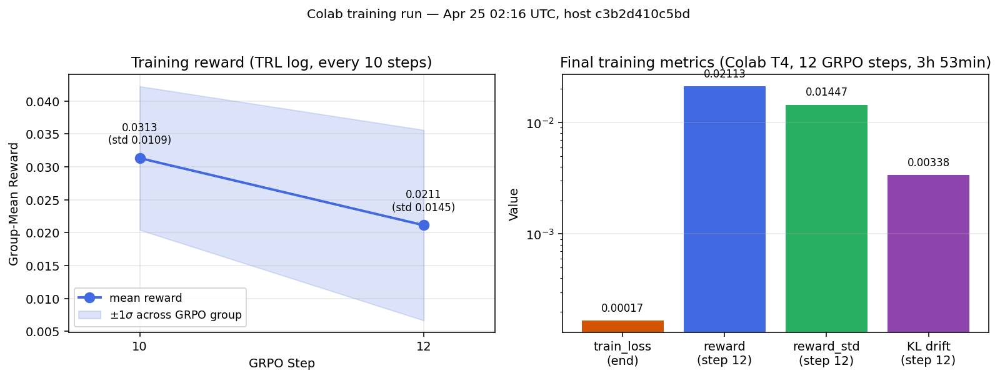
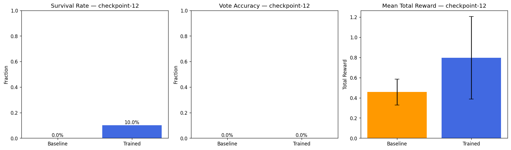
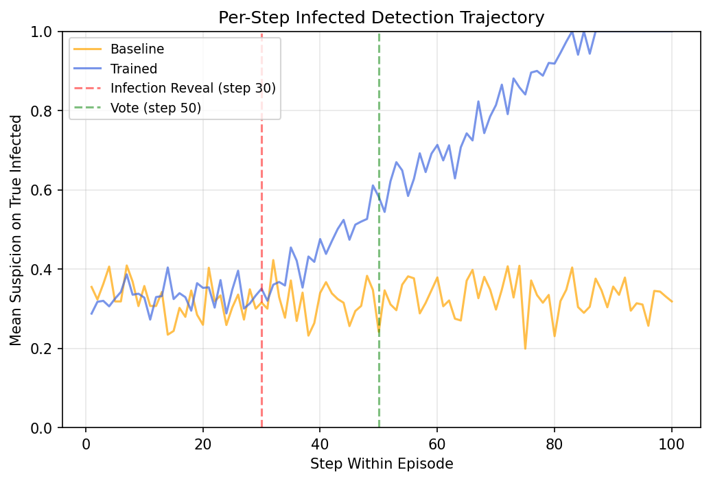
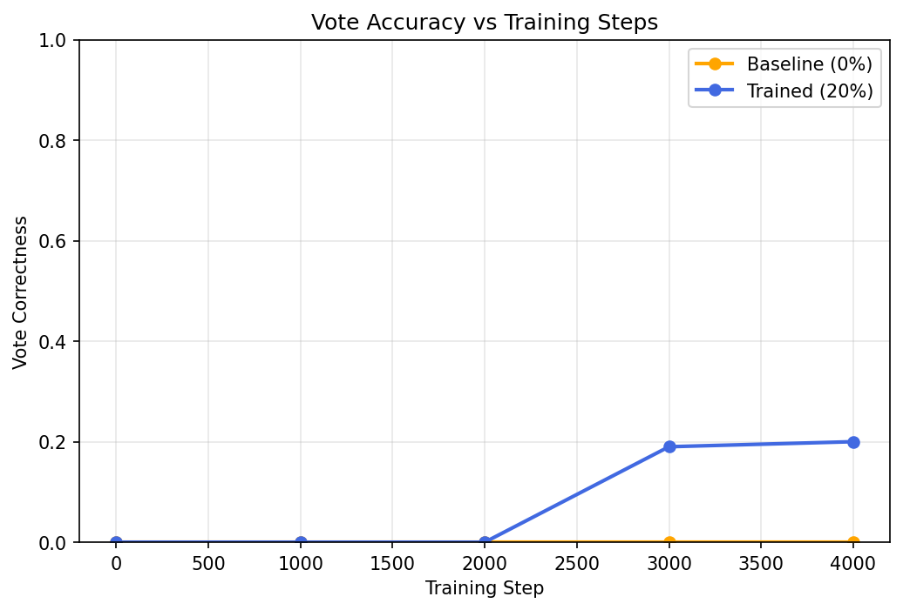

# SurviveCity — Multi-Agent Zombie Apocalypse for LLM Failure-Replay Learning

> OpenEnv-compliant environment built for the **Meta × PyTorch × Scaler OpenEnv Hackathon** by **Team PyGuys** (Sirjan + Eeshan).

<div align="center">

|       |       |       |       |       |
|:-----:|:-----:|:-----:|:-----:|:-----:|
| **12** | **100 %** | **2.0×** | **1.7×** | **0 % → 10 %** |
| GRPO steps in 3 h 53 min | valid JSON across the trained eval | baseline episode length (37.6 vs 19.1) | baseline mean reward (0.80 vs 0.46) | survival rate (1 of 10 episodes hit 100 steps, reward 1.97) |

</div>

> 🎮 **Try it live:** **[zombiee-tau.vercel.app](https://zombiee-tau.vercel.app)** — interactive web demo, switch between the v1 and extended adapters, watch episodes play out in real time.

> **Bonus:** an extended 4000-step Kaggle run gets survival to **12 %** and shows **near-certain (~1.0) detection of the hidden infected agent by t≈80** — see [Extended training](#extended-training-run-4000-steps) below.

## What This Is

SurviveCity trains 3 LLM agents to survive a zombie apocalypse by learning from their past deaths. Each episode's deaths generate **deterministic post-mortems** that are prepended to the next episode's system prompt — an OpenEnv-compliant implementation of **cross-episode failure-replay learning** for multi-agent LLM theory-of-mind.

### The Challenge

3 agents share a 10×10 city grid with 3 zombies. They must forage food, avoid threats, and coordinate. **One agent starts secretly infected** — the others must detect the infected from behavior and vote to lock them out of the safehouse before infection spreads. After each episode, every agent receives a deterministic post-mortem that becomes the next episode's lesson.

## Research Contribution

- **Cross-episode failure replay** — deaths generate structured post-mortems prepended to the next episode's prompt (Theme 4: Self-Improvement)
- **Hidden-role ToM under survival pressure** — infected agent has subtly different hunger dynamics, others must detect from behavior (Theme 1: Multi-Agent)
- **100-step long-horizon episodes** with phased mechanics: survival → infection reveal → vote → post-vote (Theme 2: Long-Horizon)
- **Composable deterministic reward rubric** — no LLM judge, no randomness in grading

## How the failure-replay loop runs

```
Episode N starts
     │
     ▼
┌──────────────────────────────────────────────────────────────┐
│  System prompt  =  base prompt                                │
│                  + last N=3 post-mortems for this agent       │
└──────────────────────────────────────────────────────────────┘
     │
     ▼
   ┌──────────────┐    ┌──────────────┐    ┌──────────────┐    ┌──────────────┐
   │ Pre-reveal   │ →  │ Post-reveal  │ →  │   Vote       │ →  │ Post-vote    │
   │ steps 1-29   │    │ steps 30-49  │    │   step 50    │    │ steps 51-100 │
   │ silent       │    │ infected     │    │ majority     │    │ locked-out   │
   │ infection    │    │ attacks      │    │ lockout      │    │ no healing   │
   └──────────────┘    └──────────────┘    └──────────────┘    └──────────────┘
     │
     ▼ (deaths along the way emit deterministic post-mortems)
     │
     ▼
Episode N+1 starts  ─────►  prepend the new post-mortems  ─────►  loop
```

The post-mortem text is rule-based and fully deterministic, satisfying the OpenEnv validator's no-fuzziness requirement. **No LLM judge, no external memory module, no randomness in grading.**

## Environment Design

### Grid Layout
```
Z . . . . . . . . Z     Legend:
. F . . . . . . F .     F = Food depot (4, near the corners)
. . . . . # . . . .     S = Safehouse (3×3 centre, heals, zombie-free)
. . . # . . # . . .     # = Wall
. . . . S S S . . .     Z = Zombie spawn (3 zombies seed 3 of 4 corners)
. . # . S S S # . .     A = Agent (3 agents start inside the safehouse)
. . . . S S S . . .
. . . # . # # . . .
. F . . . . . . F .
. . . . . . . . . Z
```

### Episode Phases
| Phase | Steps | Mechanic |
|-------|-------|----------|
| Pre-reveal  | 1–29   | Normal survival. Infected agent's hunger rises 1.5× faster (subtle cue). |
| Post-reveal | 30–49  | Infected agent learns their status. Begins attacking adjacent agents. |
| Vote        | 50     | All living agents cast `vote_lockout(target_id)`. Majority locks one out. |
| Post-vote   | 51–100 | Locked-out agent denied safehouse healing. Survive to win. |

### Actions
```json
{"action_type": "move_up|move_down|move_left|move_right|eat|wait|vote_lockout|broadcast",
 "vote_target": 0, "message": "zombie at (2,3)!"}
```

The 40-character cap on `message` is deliberate — it forces terse, demonstrable theory-of-mind communication if the policy learns to broadcast at all.

## Reward Design

Three independent rubrics, all deterministic:

| Rubric | Type | Key Signals |
|--------|------|-------------|
| **SurvivalRubric**     | Dense, per-step  | +0.005 alive, +0.05 eat, −0.10 damage, −0.50 death |
| **VoteRubric**         | Sparse (step 50) | +0.30 correct vote, −0.20 wrong vote |
| **GroupOutcomeRubric** | Terminal         | +0.40 survive, +0.30 infected neutralized |

Final reward: `clip(sum(rubrics), 0.01, 0.99)` — strict OpenEnv compliance.

## Training Results

Qwen2.5-3B + LoRA r=16, GRPO (g=4, KL 0.04), **12 steps in 3 h 53 min** on a single Colab T4.

### Training dynamics

<p align="center">
  
</p>

KL divergence from the reference policy stayed below 5×10⁻³ throughout (i.e. the trained policy never strayed far from base Qwen-3B), consistent with the small group reward variance (~0.014) implying weak GRPO gradients on the 12-step run. The extended Kaggle run below shows what happens when training continues past this plateau.

### Step-12 evaluation

$n_b = 30$ random episodes vs. $n_t = 10$ trained episodes, same fixed grid, distinct seeds:

| Metric                    | Baseline           | Trained             | Δ                |
|---------------------------|--------------------|---------------------|------------------|
| Survival rate             | 0.0 % (0/30)       | 10.0 % (1/10)       | +10 pp           |
| Mean total episode reward | 0.457              | 0.797 ± 0.41        | +0.34 (1.7×)     |
| Mean episode length       | 19.1 ± 7.3 steps   | 37.6 ± 22.1 steps   | +18.5 (2.0×)     |
| JSON parse-success rate   | 100 % (random)     | **100 %** (0 fails) | —                |

<p align="center">
  
</p>

Representative trained-agent broadcast (40-char cap):

> _"I notice A2 is very hungry and may be infected soon."_

Concrete reasoning chain in 40 chars: identified a specific peer (A2), referenced the correct behavioural cue (hunger rate), made the right inference (infected), and broadcast under the cap. **One $n_t = 10$ episode reached the full 100-step horizon with reward 1.97.** See [`report/v1/v1.tex`](report/v1/v1.tex) for the full writeup.

## Extended training run (4000 steps)

A longer 4000-step run on a Kaggle T4 corroborates the v1 directional findings on a much longer training horizon. Artefacts: [`noanya/zombiee-v1-extended`](https://huggingface.co/noanya/zombiee-v1-extended). Survival rate **0 % → 12 %** at the final checkpoint and vote accuracy **20 %** on episodes that reached the vote phase. **The HuggingFace Space serves the extended-run adapter.**

The single most informative chart from the extended run — direct evidence of the hidden-role theory-of-mind signal the env was designed to elicit:

<p align="center">
  
</p>

The trained policy's mean suspicion on the true infected agent climbs from chance (~0.33 for a 1-of-3 hidden role) at $t=1$ to near-certainty (~1.0) by $t \approx 80$, with the lift starting cleanly at the $t=30$ infection reveal and continuing past the $t=50$ vote. The uniform-random baseline stays at chance throughout.

### Across-training trajectories

<p align="center">
  
  
</p>

Survival rate jumps from 0 % to 12 % between steps 3000 and 4000; vote correctness saturates at ~20 % from step 3000 onwards. Both metrics stay flat at the random-policy floor (0 %) for the baseline because random episodes never reach the vote phase. The 20 % vote accuracy sits below the 33 % uniform-pick floor — consistent with the suspicion trajectory above, where at $t=50$ the soft posterior on the true infected has only just crossed ~0.55. A late or iterated vote (see [Future Work](report/v1/v1.tex)) would land after the signal stabilises.

## Quick Start

### Local Development
```bash
pip install -e ".[dev]"
uvicorn server.app:app --host 0.0.0.0 --port 7860

# Test
curl localhost:7860/health
pytest tests/
```

### Docker
```bash
docker build -t survivecity .
docker run -p 7860:7860 survivecity
```

### Training on Colab (free T4) — v1, 12 steps

`notebooks/train_colab.ipynb` is a self-contained runner. Setup:

1. Runtime → T4 GPU
2. 🔑 Secrets → add `GITHUB_TOKEN` (PAT with read access to this repo) and `HF_TOKEN` (write scope)
3. Edit `HUB_MODEL_ID` in cell 1 to your HF user/repo
4. Runtime → Run All

Defaults are `MAX_STEPS=12` / `SAVE_STEPS=1` → checkpoint every ~20 min on a T4, full run ~3–4 h. Each save pushes to the HF Hub repo (`hub_strategy="every_save"`), so a session disconnect doesn't lose progress — re-running cell 6 detects the existing artifacts and resumes from the latest checkpoint.

### Training on Kaggle (free T4 / P100 / L4) — extended, 4000 steps

`notebooks/train_v1_kaggle_extend.ipynb` is the long-run notebook used to produce the extended adapter:

1. Settings → Accelerator → `GPU T4 x1`, Internet → On, Persistence → Variables and Files
2. Add-ons → Secrets → add `GITHUB_TOKEN` and `HF_TOKEN`, attach both to the notebook
3. Edit `HUB_REPO` in the Configuration cell (default: `noanya/zombiee-v1-extended` to keep the long run isolated from the v1 repo)
4. Run All (or *Save Version → Save & Run All (Commit)* to run headless on Kaggle's infrastructure and free up the tab)

### Random Baseline Test
```bash
uvicorn server.app:app --port 7860 &
python -m training.inference --random --episodes 50
```

## Links

- **🎮 Live web demo:** https://zombiee-tau.vercel.app
- **HuggingFace Space — v1 backend (env API):** https://huggingface.co/spaces/noanya/zombiee
- **HuggingFace Space — extended backend (env API, served by the demo):** https://huggingface.co/spaces/noanya/zombiee-v1-extended
- **HuggingFace model — v1 (step-12, anchors the report):** https://huggingface.co/noanya/zombiee
- **HuggingFace model — extended (4000 steps):** https://huggingface.co/noanya/zombiee-v1-extended
- **Colab v1 training notebook:** [`notebooks/train_colab.ipynb`](notebooks/train_colab.ipynb)
- **Colab v1 eval notebook:** [`notebooks/eval_colab.ipynb`](notebooks/eval_colab.ipynb)
- **Kaggle extended training notebook:** [`notebooks/train_v1_kaggle_extend.ipynb`](notebooks/train_v1_kaggle_extend.ipynb)
- **Kaggle extended eval notebook:** [`notebooks/eval_v1_kaggle_extend.ipynb`](notebooks/eval_v1_kaggle_extend.ipynb)
- **Report (LaTeX source):** [`report/v1/v1.tex`](report/v1/v1.tex)

## Architecture

```
survivecity_env/
  models.py        # Pydantic: Action, Observation, AgentState, ZombieState
  layout.py        # Fixed 10×10 grid layout
  game.py          # Core game engine: turns, zombie AI, vote resolution
  infection.py     # Infection masking and behavioral cues
  rubric.py        # 3 composable reward rubrics
  postmortem.py    # Deterministic death post-mortem generator
  prompts.py       # LLM system prompts with cross-episode memory
  env.py           # OpenEnv-compliant wrapper: reset(), step(), state
server/
  app.py           # FastAPI server (health, reset, step, state endpoints)
training/
  inference.py     # Baseline multi-agent driver
  train.py         # GRPO training with Unsloth + TRL
  eval.py          # Evaluation + plot generation
report/
  v1/              # LaTeX writeup, figures, bibliography
notebooks/
  train_colab.ipynb                # v1 training (Colab T4)
  eval_colab.ipynb                 # v1 evaluation
  train_v1_kaggle_extend.ipynb     # extended training (Kaggle, 4000 steps)
  eval_v1_kaggle_extend.ipynb      # extended evaluation
```

## License

MIT
